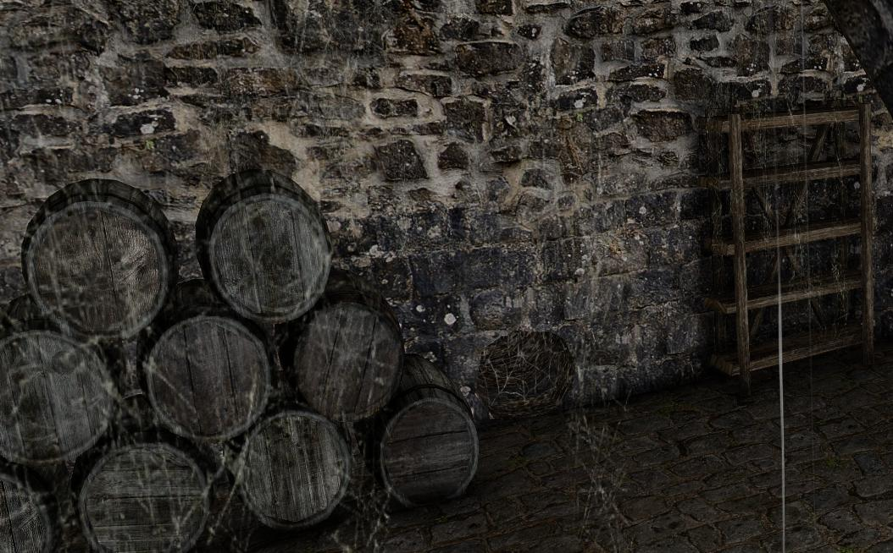

> **Kolejność wykonywania zadań:**
>
> 1. [Dłużnik Gunnara](/gildie-glowne/zwiadowca/#dluznik-gunnara)
> 2. [Liczenie owiec](/gildie-glowne/zwiadowca/#liczenie-owiec)
> 3. [Dołączenie do zwiadowców](/gildie-glowne/zwiadowca/#dolaczenie-do-zwiadowcow)
> 4. [Infiltracja gildii złodziei](/gildie-glowne/zwiadowca/#infiltracja-gildii-zlodziei)
> 5. [Tajemnica starej wieży](/gildie-glowne/zwiadowca/#tajemnica-starej-wiezy)
> 6. [Stare ruiny](/gildie-glowne/zwiadowca/#stare-ruiny)
> 7. [Sztandar Ognia (Rozdział 2)](/gildie-glowne/zwiadowca/#sztandar-ognia-rozdzial-2)
> 8. [Orkowa galera (Rozdział 3)](/gildie-glowne/zwiadowca/#orkowa-galera-rozdzial-3)
> 9. [W pogoni za mrokiem (Rozdział 3)](/gildie-glowne/zwiadowca/#w-pogoni-za-mrokiem-rozdzial-3)
> 10. [Skarb Rączki](/gildie-glowne/zwiadowca/#skarb-raczki)
> 11. [Na tropie zdrady (Rozdział 4)](/gildie-glowne/zwiadowca/#na-tropie-zdrady-rozdzial-4)

> **Zadania dodatkowe:**
>
> 1. [Likwidacja orkowych najemników (Rozdział 2)](/gildie-glowne/zwiadowca/#likwidacja-orkowych-najemnikow-rozdzial-2)
> 2. [Sabotaż](/gildie-glowne/zwiadowca/#sabotaz-rozdzial-2)

## Dłużnik Gunnara {#dluznik-gunnara}

**Zleca: Gunnar**

> Zadanie wprowadza nas do gildii Zwiadowców.

Gunnar prosi o odnalezienie człowieka, któremu pożyczył złoto. Ciało znajdujemy niedaleko Groma, na skałach pod wieżą Dextera.

## Liczenie owiec {#liczenie-owiec}

**Zleca: Notka znaleziona przy ciele z zadania [Dłużnik Gunnara](/gildie-glowne/zwiadowca/#dluznik-gunnara)**

Po przeczytaniu notatki udajemy się do Lorda Andre i zdajemy raport. Po rozmowie zaczepia nas Allen i proponuje [Dołączenie do zwiadowców](/gildie-glowne/zwiadowca/#dolaczenie-do-zwiadowcow).

## Dołączenie do zwiadowców {#dolaczenie-do-zwiadowcow}

**Zleca: Allen**

Allen zleca nam odebranie raportów od trzech żołnierzy:

1. Zwiadowcy przy bramie na przełęcz.
2. Strażnika bramy do Fortu Azgan (za farmą Onara).
3. Zwiadowcy przy drodze między farmą Akila a lasem — pójdziemy z nim także zapolować na grupkę orków.

Po rozmowie z każdym z nich wracamy do Allena i oficjalnie dołączamy do zwiadowców.

## Infiltracja gildii złodziei {#infiltracja-gildii-zlodziei}

**Zleca: Allen**

Naszym celem jest infiltracja gildii złodziei i zebranie informacji o Rączce.

Udajemy się do kanałów pod Khorinis, do pomieszczenia za zamkniętymi drzwiami, gdzie znajduje się skrzynia Rączki. Zabieramy z niej dziennik (pojawi się nawet, jeśli skrzynia została wcześniej opróżniona) i go czytamy.

Następnie wchodzimy do pustego pomieszczenia obok Attili i używamy zaklęcia światła — w ścianie otworzy się tajne przejście, przez które przechodzimy w przemianie.

Zbieramy wszystko, co znajdziemy, czytamy pulpit i oglądamy obrazek. Wracamy do Allena, kończymy zadanie i rozpoczynamy [Tajemnicę starej wieży](/gildie-glowne/zwiadowca/#tajemnica-starej-wiezy).

## Tajemnica starej wieży {#tajemnica-starej-wiezy}

**Zleca: Allen**

Udajemy się do wieży na plaży obok Skipa. Po rozmowie z Allenem i krótkiej cutscence wspinamy się po drabinie i używamy kołowrotu, by otworzyć przejście. Wracamy do Allena i przenosimy się do nowej bazy, gdzie kontynuujemy rozmowę.

Otrzymujemy list, który mamy dostarczyć Lordowi Hagenowi. Po powrocie kończymy zadanie i rozpoczynamy [Stare ruiny](/gildie-glowne/zwiadowca/#stare-ruiny).

## Stare ruiny {#stare-ruiny}

**Zleca: Allen**

Na statku paladynów szukamy księgi — znajduje się na stole alchemicznym. Wracamy do Allena, który wysyła nas do zniszczonego fortu za latarnią Jacka. Czyścimy teren, czytamy notatki i wracamy do Allena zakończyć zadanie.

## Sztandar Ognia (Rozdział 2) {#sztandar-ognia-rozdzial-2}

**Zleca: Allen**

> Aby rozpocząć to zadanie, musimy przejść przez portal do Jarkendaru i porozmawiać z Saturasem.

Allen zleca odnalezienie Sztandaru Ognia. Wyruszamy na skały nad legowiskiem Czarnego Trolla. Na polanie z trollami znajduje się przejście do osobnej lokacji za jaskiniowym trollem.

Spotykamy Erwina — zdobywamy dla niego krzesiwo (z wraku statku lub kupując od Matteo za 300 sztuk złota). Erwin informuje nas, że sztandar został skradziony i wręcza skrzyneczkę z kluczem. Wracamy do Allena.

## Sabotaż (Rozdział 2) {#sabotaz-rozdzial-2}

**Zleca: Jergen (przy kopalni Fajetha)**

Musimy dokonać sabotażu w obozie orków. Udajemy się pod miasto orków (tam, gdzie w podstawce był bagienny smok) i odnajdujemy studnię strzeżoną przez orka.

Pozwalamy się zagadać, następnie usypiamy go zwojem Snu (tak, aby nie zauważyli nas inni orkowie) i zatruwamy studnię. Po wszystkim wracamy do Jergena.

## Likwidacja orkowych najemników (Rozdział 2) {#likwidacja-orkowych-najemnikow-rozdzial-2}

**Zleca: Allen**

> Aby rozpocząć zadanie, musimy zdobyć Ulu-Mulu od orkowych najemników w Górniczej Dolinie.

Allen zleca zabicie orkowych najemników w Górniczej Dolinie. Eliminujemy ich i wracamy do Allena.

## Orkowa galera (Rozdział 3) {#orkowa-galera-rozdzial-3}

**Zleca: Allen**

> Wymaga wcześniejszego dostarczenia Hagenowi wiadomości od Garonda.

Allen wspomina o orkowej galerze w pobliżu Khorinis. Udajemy się do Przeklętej Latarni i korzystamy z lunety (tylko w dzień, między 5:00 a 18:40, przy dobrej pogodzie). Po cutscence idziemy na południowy brzeg wyspy (między miastem a wieżą Xardasa, obok jaskini bandytów Cavalorna). Pokonujemy orków i podpalamy ich statek. Wracamy do Allena.

## W pogoni za mrokiem (Rozdział 3) {#w-pogoni-za-mrokiem-rozdzial-3}

**Zleca: Allen**

> Zadanie dostępne po ukończeniu [Orkowej galery](/gildie-glowne/zwiadowca/#orkowa-galera-rozdzial-3).

Musimy dowiedzieć się, co stało się z Eugene i Nathanielem. Udajemy się do kamiennego kręgu koło farmy Lobarta — znajdujemy tam rannego Nathaniela.

Po rozmowie ruszamy w stronę wieży Xardasa. Przed jaskinią bandytów spotykamy Eugene — rozmawiamy z nim, a następnie pokonujemy poszukiwaczy. Znów rozmawiamy z Eugene i wracamy do Nathaniela.

Nathaniel atakuje nas — po walce udajemy się do klasztoru, gdzie kupujemy od Pyrokara miksturę. Wracamy do naszej bazy, podajemy miksturę Nathanielowi i kończymy zadanie u Allena.

## Skarb Rączki {#skarb-raczki}

**Zleca: Allen**

Musimy zdobyć cztery złote klucze Rączki, aby otworzyć przejście w jego dawnej kryjówce.

**Lokalizacje kluczy:**

1. Skarbiec na Wyspie Złodziei
2. U Rączki — wymaga 60 retoryki
3. Zakopany przy wykopaliskach Magów Wody (można wykopać w trakcie zadania [Ktoś coś zgubił?](/solucja/rozdzial-iii/#ktos-cos-zgubil))
4. U Erwina w nowej lokacji za górami trolli (tam trafiamy w zadaniu [Sztandar Ognia](/gildie-glowne/zwiadowca/#sztandar-ognia-rozdzial-2))

## Na tropie zdrady (Rozdział 4) {#na-tropie-zdrady-rozdzial-4}

**Zleca: Allen**

> Dostępne po zdobyciu wszystkich kluczy i otwarciu skarbca w zadaniu [Skarb Rączki](/gildie-glowne/zwiadowca/#skarb-raczki).

Allen informuje nas, że Nathaniel ukradł Róg Strachu i uciekł. Czytamy notatkę, rozmawiamy z Allenem, a następnie udajemy się do klasztoru porozmawiać z Pyrokarem.

Potem ruszamy do jaskini niedaleko legowiska Czarnego Trolla (jaskinia z próbą ognia). Pokonujemy Mistrzów Mroku oraz Władcę Mroku i jego sługi. Na końcu rozmawiamy z Nathanielem i decydujemy, czy go zabić, czy darować mu życie. Wracamy do Allena i zamykamy wątek zwiadowców.
