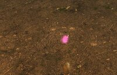
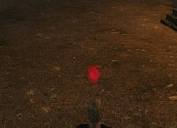
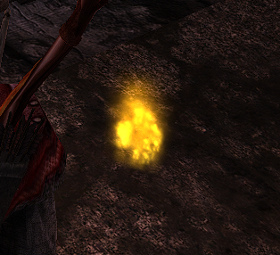
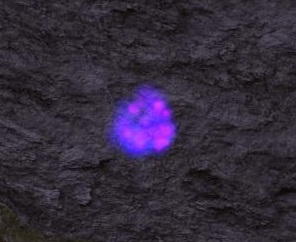
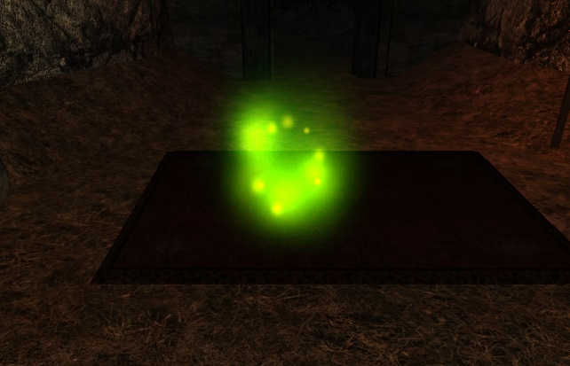
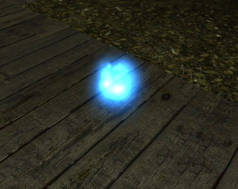
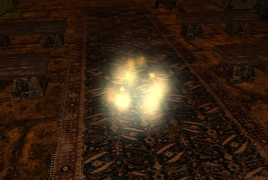
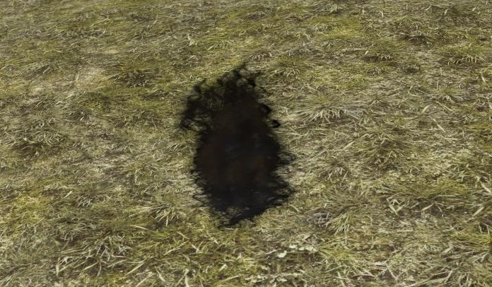

import Tabs from '@theme/Tabs';
import TabItem from '@theme/TabItem';

## Ogólne zmienne {#ogolne-zmienne}

Poniższe wartości przyjmują wartości:

- 1 - włączenie opcji
- 0 - wyłączenie opcji

| Nazwa                             | Opis                                                                                               |
| --------------------------------- | -------------------------------------------------------------------------------------------------- |
| extModeActivate                   | Włącza tryb ulepszeń i pieczęci (działa od nowej gry)                                              |
| bSkipLogo                         | Pominięcie cutscenki na początku gry (Mowa Xardasa i lot kamerą wokół jego wieży)                  |
| bToggleLockPickHelper             | Włącza podpowiedzi podczas okradania skrzynek                                                      |
| bPoisonWeaponEffect               | Włącza efekt wizualny trucizny na broni (tylko dla mistrza trucizn)                                |
| bToggleSpellHint                  | Włącza wyświetlanie obecnie wybranego czaru                                                        |
| bToggleShowStat Plus              | Dodaje znak "+" przed wyświetlaną wartością zregenerowaniego życia lub many                        |
| bShowEnemyHealth                  | Pokazuje ilość życia przeciwnika                                                                   |
| bQuickLootEnabled                 | Włącza quickloota                                                                                  |
| bHideWaterMageIceShield           | Chowa efekty wizualne magicznej tarczy Magów Wody                                                  |
| FreezeHeroSpeedNormal             | Wyłącza skalowanie szybkości biegania postaci z wytrzymałością i zrecznością                       |
| bToggleSeparateHealManaNumbers    | Włącza wyświetlanie regeneracji many i życia w postaci oddzielnych tekstów                         |
| bHideBarsText                     | Włączenie chowa nazwy pasków (życie/mana/wytrzymałość)                                             |
| bNewLegPlusNB                     | Włącza możliwość wyboru poziomu trudności Nightmare+                                               |
| bShowMesMemoryFull                | Włącza pokazywanie komunikatu o braku dostępnej pamięci                                            |
| bGlobalStaggerEnabled             | Włącza ogłuszanie (przewracanie) innych postaci podczas walki w zwarciu                            |
| bShowStaggerVisual                | Włącza pasek ogłuszania                                                                            |
| bShowPoisonBarVisual              | Włącza pasek zatrucia                                                                              |
| bCanRenderHotbarInBattle          | Włącza możliwość używania paska szybkiego wyboru podczas walki                                     |
| bProtectTraders                   | Włączenie opcji chroni kupców przed utratą ekwipunku po ich pobiciu                                |
| nightmareZeroLP                   | Włączenie opcji spowoduje włączenie trybu 0pn/lvl na poziomie trudności Nightmare                  |
| bShowSummonHealthBar              | Włącza wyświetlanie oddzielnego paska życia dla niektórych przyzwańców (Hubaxis, Krayt, Jina, Sid) |
| bShowSummonHealthBarPosX          | Pozycja X dla paska summonów                                                                       |
| bShowSummonHealthBarPosY          | Pozycja Y dla paska summonów                                                                       |
| bToggle_SightColorAimBySpellLevel | Włącza podświetlenie przeciwnika podczas łądowania czarów                                          |
| bLinuxMusicFix                    | Dla systemów Linux - wyłączenie muzyki w menu, żeby zapobiec crashom                               |

## Wygląd ognika {#wyglad-ognika}

Wartości trzeba zmienić w gothic.ini w sekcji `[WISP_SETTINGS]`.

| Nazwa          | Domyślna wartość | Poprawne wartości      | Opis                                                                     |
| -------------- | ---------------- | ---------------------- | ------------------------------------------------------------------------ |
| ppsvalue       | 100              | 1-500                  | Zwiększa ilość cząsteczek wydzielanych przez ognika i gęstość jego ognia |
| shpdim_s       | 15               | 1-100                  | Średnia wielkość płomienia                                               |
| color          | 255 255 255      | Kolor RGB              | Kolor głównego światła                                                   |
| colorEnd       | 255 255 255      | Kolor RGB              | Kolor światła dodatkowego                                                |
| vissizestart_s | 50 50            | 1-500                  | Wielkość cząsteczek ognika                                               |
| visAlphaStart  | 0                | 0-255                  | Minimalna wartość przezroczystości (opacity)                             |
| visAlphaEnd    | 230              | 0-255                  | Maksymalna wartość przezroczystości (opacity)                            |
| visalphafunc_s | ADD              | ADD lub BLEND          | Rodzaj wymieszania kolorów                                               |
| visname_s      | BLUEGLOW.TGA     | Nazwa tekstury światła | Zmienia teksturę światła                                                 |

## Presety ognika {#presety-ognika}

Oryginalnie udostępnione na [RPGRussia](https://rpgrussia.com/threads/novyj-balans-nastrojka-vneshnego-vida-ogonka.41048/).

<Tabs queryString="presety-ognika" defaultValue="rozowy">

<TabItem value="rozowy" label="Różowy">

```ini
ppsvalue=125
shpdim_s=10
color=213 45 129
colorEnd=255 45 87
vissizestart_s=50 50
visAlphaEnd=230
visAlphaStart=30
visalphafunc_s=ADD
visname_s=BLUEGLOW.TGA
```




</TabItem>

<TabItem value="czerwony-dym" label="Czerwony dym">

```ini
ppsvalue=100
shpdim_s=10
color=255 0 0
colorEnd=255 42 63
vissizestart_s=40 40
visAlphaEnd=255
visAlphaStart=80
visalphafunc_s=BLEND
visname_s=BADWEATH.TGA
```




</TabItem>

<TabItem value="zlote-swiatlo" label="Złote światło">

```ini
ppsvalue=100
shpdim_s=10
color=255 150 0
colorEnd=255 232 42
vissizestart_s=40 40
visAlphaEnd=255
visAlphaStart=80
visalphafunc_s=BLEND
visname_s=BADWEATH.TGA
```




</TabItem>

<TabItem value="niebiesko-purpurowy" label="Niebiesko purpurowy">

```ini
ppsvalue=100
shpdim_s=15
color=0 0 255
colorEnd=255 0 255
vissizestart_s=40 40
visAlphaEnd=200
visAlphaStart=200
visalphafunc_s=ADD
visname_s=BLUEGLOW.TGA
```




</TabItem>

<TabItem value="trujacy" label="Trujący">

```ini
ppsvalue=120
shpdim_s=15
color=0 250 0
colorEnd=250 120 0
vissizestart_s=50 50
visAlphaEnd=230
visAlphaStart=0
visalphafunc_s=add
visname_s=BLUEGLOW.TGA
```




</TabItem>

<TabItem value="magiczny" label="Magiczny">

```ini
ppsvalue=110
shpdim_s=10
color=0 125 255
colorEnd=105 175 255
vissizestart_s=50 50
visAlphaEnd=230
visAlphaStart=0
visalphafunc_s=add
visname_s=BLUEGLOW.TGA
```




</TabItem>

<TabItem value="swiete-swiatlo" label="Święte światło">

```ini
ppsvalue=100
shpdim_s=15
color=250 250 250
colorEnd=250 120 0
vissizestart_s=50 50
visAlphaEnd=230
visAlphaStart=0
visalphafunc_s=add
visname_s=BLUEGLOW.TGA
```




</TabItem>

<TabItem value="czarna-dziura" label="Czarna dziura">

```ini
ppsvalue=100
shpdim_s=15
color=0 0 0
colorEnd=10 10 10
vissizestart_s=50 50
visAlphaEnd=255
visAlphaStart=255
visalphafunc_s=BLEND
visname_s=BlackFlash_A5.tga
```




</TabItem>

<TabItem value="niewidzialny" label="Niewidzialny">

```ini
ppsvalue=20
shpdim_s=3
color=255 150 0
colorEnd=255 232 42
vissizestart_s=5 5
visAlphaEnd=255
visAlphaStart=80
visalphafunc_s=BLEND
visname_s=BADWEATH.TGA
```


</TabItem>

</Tabs>

## Zmiany kolorów {#zmiany-kolorow}

| Nazwa                                                                      | Domyślne wartości | Opis                                                                                 |
| -------------------------------------------------------------------------- | ----------------- | ------------------------------------------------------------------------------------ |
| dialogSelectedColorR <br/> dialogSelectedColorG <br/> dialogSelectedColorB | 255, 221, 0       | Określa kolor wybranej opcji dialogowej                                              |
| dialogCommonColorR <br/> dialogCommonColorG <br/> dialogCommonColorB       | 255, 255, 255     | Określa kolor regularnych dialogów                                                   |
| iColorPoisonR <br/> iColorPoisonG <br/> iColorPoisonB                      | 3, 132, 26        | Zmienia kolor wyświetlanego tekstu informującego o obrażeniach zadanych od trucizny |
| expColorR <br/> expColorG <br/> expColorB                                  | 14, 122, 18       | Zmienia kolor wyświetlanego tekstu informującego o zdobytym doświadczeniu           |
| iColorDayR <br/> iColorDayG <br/> iColorDayB                               | 245, 247, 225     | Zmienia kolor wyświetlanego tekstu informującego o godzinie w grze                  |

## Włączenie zawartości {#wlaczenie-zawartosci}

Włączenie 7 rozdziału i opiekunów (działa od nowej gry):
- Nazwa - **bOldGuardiansWay**
- Wartość - 831407

Włączenie zadania z zębaczem u Xardasa (działa od nowej gry):

- Nazwa - **bSnapperQuestStart**
- Wartość - 1

Włączenie zadań, które zostały usunięte w patchu z areną (działa od nowej gry):

- Nazwa - **bOldQuestsAvailable**
- Wartość - 1788301

Lista zadań:

- Błąd lorda Andre
- Nóż Hildy
- Facet bez dziury chodzi ponury
- Loa wspomnienia
- Problematyczny strażnik
- Błąd Lorda Andre
- Nóż Hildy
- Facet bez dziury chodzi ponury
- Zapomniane wspomnienia Loi
- Kłopotliwy strażnik
- Nekromanta w Khorinis
- Przebaczenie dla zdrajcy
- Obawy Pepe
- Poszukiwania nowicjusza
- Szybki sposób na zarobek
- Zbrodnia i kara
- Zadanie ze Świstakiem
- Kłopoty Parcivala
- Zadanie z Miltenem (od Brutusa)
- Cień w potrzebie
- Kłopoty Parcivala
- Magiczne zbawienie
- Przeklęte dusze
- Orkowie nad jaskinią
- Statek dla Sylvio
- Dług Sylvio
- Zemsta Pradawnych

Nowe zdolności potworów na dowolnym poziomie trudności (działa od nowej gry):

- Nazwa - **MosterAbilitiesAvailableAtAnyDifficulty**
- Wartość - 959195

## Inne {#inne}

| Nazwa            | Domyślna wartość                    | Opis                                                                        |
| ---------------- | ----------------------------------- | --------------------------------------------------------------------------- |
| iMsgPositionX    | 200 - na lewo <br/> 4000 - na prawo | Określa pozycję wyświetlanych komunikatów                                   |
| bMinimalHealShow | 5                                   | Granica, powyżej której będzie wyświetlana ilość regenerowanej many i życia |
| arrowsInfoPosY   | 8                                   | Wysokość tekstu z ilością strzał. Zwiększ wartość, żeby obniżyć tekst       |
