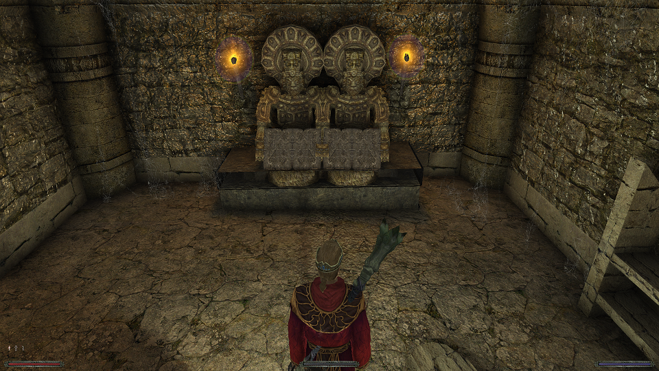
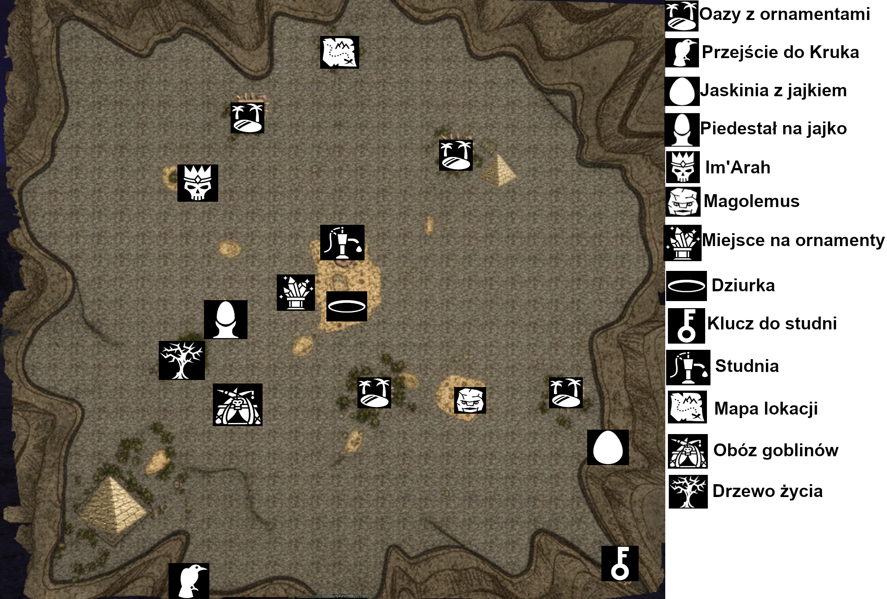
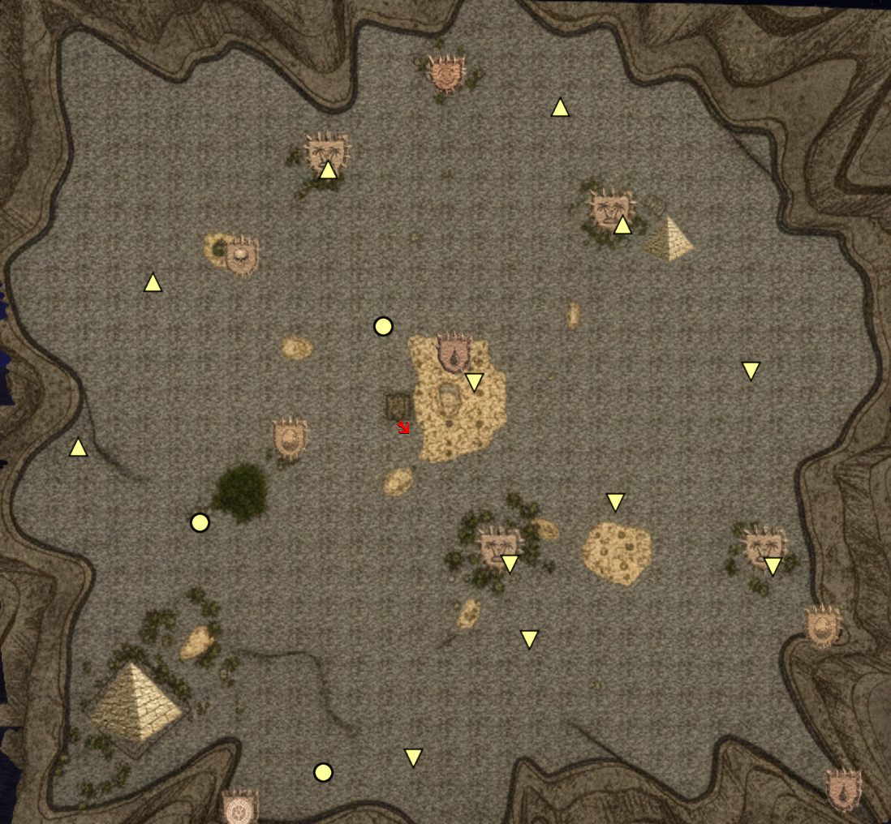
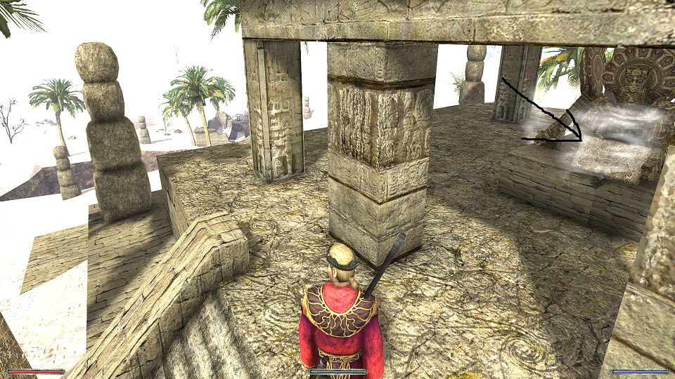
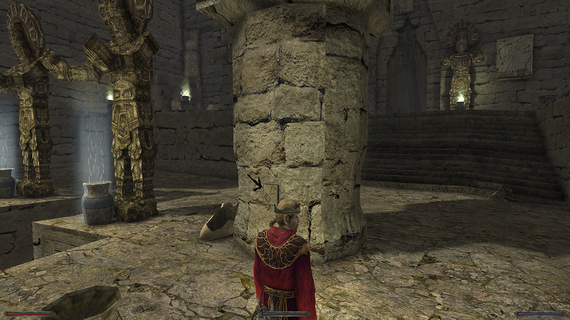
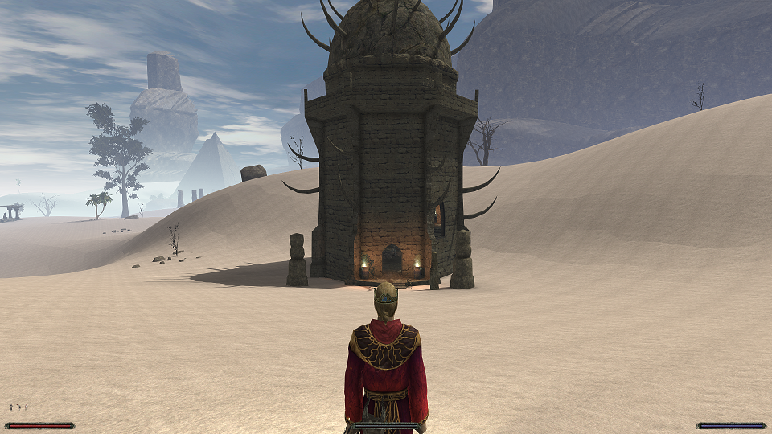
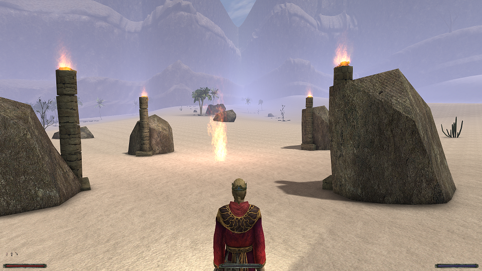
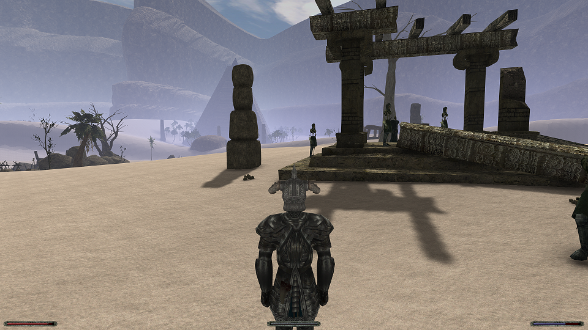
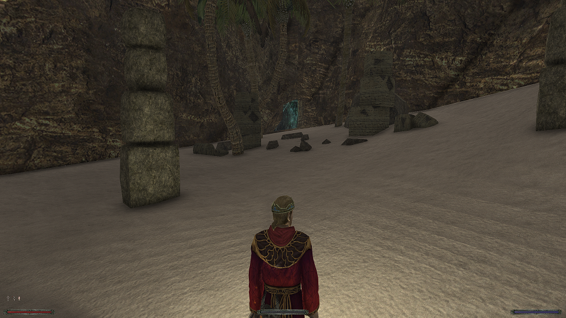
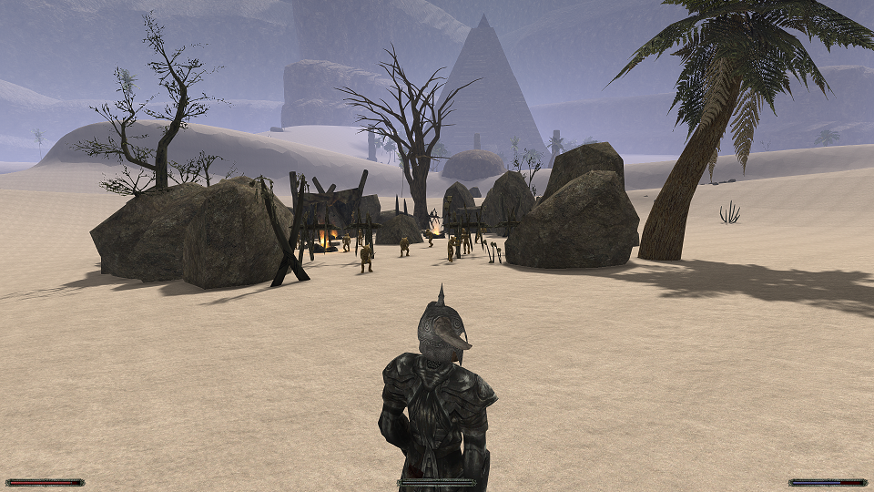

import Tabs from '@theme/Tabs';
import TabItem from '@theme/TabItem';

## Jak się dostać na pustynię Adanosa. {#jak-sie-dostac-na-pustynie-adanosa}

W trakcie walki z Krukiem w Jarkendarze, ten znika, a my idziemy do pomieszczenia z teleportem, jednak przed teleportacją zabieramy wszystkie przedmioty leżące obok: kryształ, płytkę i runę przyzwania kamiennego strażnika. Czytamy tabliczkę, idziemy z nią do Saturasa i gadamy z nim o Kruku, a potem o krysztale, możemy przy okazji pogadać z Nefariusem o runie. Kryształ uaktywnia teleport w ruinach na placu z magami wody, używamy go na piedestale i przechodzimy przez teleport. Tam napotkamy kamienną pumę, którą zabijamy i aktywujemy kolejny teleport, tym razem do osobnej lokacji.
> Niedaleko kamiennej pumy rośnie również kwiatek potrzebny do zadania [Nieziemskie sny](/solucja/rozdzial-i/#nieziemskie-sny).

Dostajemy się do oazy złotego smoka Ashtara, rozmawiamy z nim, a ten twierdzi, że tabliczka musi zostać naładowana mocą runy, którą znaleźliśmy po walce z Krukiem. Udajemy się zatem do biblioteki w kanionie i przekierowujemy moc runy na tabliczkę, poniżej screen miejsca, w którym możemy to zrobić.

\

Korzystając z pierścienia, który znaleźliśmy po walce z Krukiem przenosimy się do miejsca, w którym go pokonaliśmy i czytamy naładowaną tabliczkę. Obudzi się Wielki Starożytny Strażnik, który po krótkiej rozmowie nas zaatakuje. Możemy go uderzyć by dowiedzieć się, że jest nieśmiertelny. Wracamy do Ashtara i dowiadujemy się, że potrzebny będzie Młot Adanosa, znajdziemy go na ołtarzu z zombie w świątyni w obozie bandytów. Uzbrojeni w młot zabijamy strażnika i zabieramy z niego kamień, który pokazujemy Astarowi. Smok informuje nas o treści tabliczki i możemy teraz uaktywnić kulę budowniczych w bibliotece w kanionie, co otworzy przejście do Pustyni Adanosa - rozległej lokacji, docelowo przewidzianej na 3 rozdział.
> Po rozmowie ze smokiem w bibliotece pojawią się duchy cieniostworów wraz z bossem. Jeżeli chcemy uniknąć spotkania z nimi, to zamiast rozmawiać ze smokiem aktywujemy kulę od razu po pokonaniu strażnika.

:::info Informacja

Uwaga: Na pustyni w trakcie dnia będziemy tracić wytrzymałość, chyba że nauczymy się odporności na gorąco od Gonzalesa lub wypijemy Płomień Eligora. Utrata wytrzymałości ustaje o godzinie 18

:::

## Wątek pustyni Adanosa {#watek-pustyni-adanosa}

Mapa pustyni i krzyształ ogniskujący znajdują się w pierwszym budynku, na jednym z piedestałów teleportujących. Kryształ pozwoli nam aktywować teleporty do ważnych miejsc. Polecam NIE atakować goblinów pustynnych jeżeli natkniesz się na ich obóz.

<Tabs queryString="watek-pustyni-adanosa" defaultValue="miejsca-szczegolne">

<TabItem value="miejsca-szczegolne" label="miejsca szczególne">

</TabItem>

<TabItem value="starozytne-tabliczki" label="starożytne tabliczki">

</TabItem>

</Tabs>

Pierwszym krokiem będzie zebranie 4 kawałków ornamentu. Znajdziemy je w oazach. Dwóch kluczy pilnują Mroczni Strażnicy, a dwóch Wyżsi Kapłani Budowniczych.\
Kiedy już zbierzecie 4 odłamki musicie umieścić je w pulpitach w tej piramidzie

Po włożeniu odłamków do pulpitów otworzy się wejście do mniejszej piramidy, gdzie znajduje się pierwszy z artefaktów, który musimy zdobyć: Berło Adanosa. Teraz skaczemy do wielkiej dziury na pustyni w centrum pustyni. Będąc już na dnie znajdujemy pałkę i walimy nią w gong kilka razy. Pojawi się wielki pełzacz, na którego zwalamy filar obok, plądrujemy zwłoki i skrzynię w leżu pełzacza gdzie znajdziemy element potrzebny do wejścia do Świątyni Łez. Idziemy dalej, skaczemy niżej i czytamy pulpit co otwiera przejście obok. Wchodzimy tam do nowej lokacji.

Idziemy teraz w dół i eksplorujemy okolicę. By dostać się na górę wspinamy po kamieniach wystających ze skały na ścianie wzdłuż ścieżki. By otworzyć przejście do świątyni wciskamy ten przycisk:

Idziemy prosto przed siebie, aż natrafimy na rozwidlenie, w prawo ścieżka maga, a w lewo wojownika. Ze względu na nagrody polecam wybrać w zależności od klasy naszej postaci, gdyż wejść możemy tylko do jednego pokoju. Zabijamy tam bossa i czytamy pulpit co otwiera nam dalszą drogę. Na drodze stanie nam specyficzny mroczny boss, a kolejny będzie boss kamienny strażnik, którego pokonujemy młotem Adanosa. Trafimy do pomieszczenia z łzą Adanosa, którą zabieramy wraz z resztą fantów. Teraz wracamy tam gdzie wybieraliśmy pomieszczenie i wchodzimy na teleport przenoszący z powrotem na pustynię. Mając berło i łzę klikamy w ekwipunku na berło co łączy artefakty w całość i powoduje pojawienie się przed nami strażnika, którego zabijamy i podnosimy połowę tablicy. Druga połówka jest w posiadaniu maga Im’Araha w wieży:

\

Mając obydwie połówki musimy połączyć je w budynku obok mniejszej piramidy, gdzie znaleźliśmy berło Adanosa, po połączeniu czytamy tabliczkę. Idziemy teraz przed wielką piramidę, zabijamy dwóch mrocznych strażników i otwieramy wejście przy pomocy tabliczki. Czytamy dwa pulpity w środku po lewej, trzeciego nie możemy, gdyż tymczasowo jest zablokowany. Dostaniemy 2 zadania:

1. Zabić stworzenie Innosa - golema Magolemusa, który pojawia się w miejscu ze zdjęcia niżej. Najłatwiej pokonać go Świętym Młotem Innosa z klasztoru. Alternatywnie jest wrażliwy na inne bronie między 21:00 a 4:00 oraz podczas deszczu.

\

2. Umieścić smocze jajo na piedestale w ruinach niedaleko obozu goblinów. Możemy je znaleźć w małej jaskini znajdującej się na obrzeżach pustyni. Jeżeli wykorzystaliśmy już pustynne jajko to pozostaje nam szukać ich w skarbach smoków lub w jaskiniach Khorinis od 4 rozdziału.

\

Po wykonaniu obydwóch powyższych prób, wracamy do dużej piramidy i czytamy główny pulpit, który jest już dostępny. Trzecim zadaniem będzie ożywienie drzewa życia. Znajdziemy je nieopodal kamiennego kręgu i czarnego trolla.
Mamy 2 opcje:

<Tabs queryString="watek-pustyni-adanosa-2" defaultValue="pomoc-baal-netbeka">

<TabItem value="pomoc-baal-netbeka" label="Pomoc Baal Netbeka">

Netbeka znajdziemy w Górniczej Dolinie, w Klasztorze Zmiennokształtnych, gdzie z Gornem szukaliśmy kamienia ogniskującego w G1. Drzewolubny łysol z chęcią pomoże nam za darmo.

</TabItem>

<TabItem value="pomoc-xardasa" label="Pomoc Xardasa">

Pytamy się Saturasa czy może nam pomóc, a ten odsyła nas do Xardasa, twierdząc, że nekromanta zajmował się kiedyś magią druidów. Xardas zgadza się stworzyć dla nas korzeń życia, jednak będzie potrzebował do tego rzadkich roślin:
- kwiat kaktusa
- ognisty korzeń
- 3x roślina lecznicza
- szczaw królewski
- trollest (wyspawni się u Zurisa)

Lepiej skorzystać z pomocy Netbeka by nie wydawać cennego szczawiu królewskiego. Na dodatek pomoc Netbeka przepada po zapytaniu się Xardasa o pomoc, więc nie można wyspawnić sobie darmowego trollestu.

</TabItem>

</Tabs>

Wracamy do kamiennego kręgu i składamy korzeń życia na ołtarzu. Drzewo zakwita, a my wracamy do dużej piramidy i wchodzimy przez teleport do Czyśca Adanosa gdzie zbieramy fanty i czytamy pulpit na środku.
> Przeczytanie pulpitu oczyści nas z grzechów resetując negatywną karmę u Bogów, możemy więc trochę nagrzeszyć zanim to zrobimy.

W piramidzie powinno otworzyć się przejście na dół, gdzie znajdziemy potężne przedmioty, a w tym Koronę Adanosa. Teraz możemy udać się dalej przez jaskinię blisko dużej piramidy tutaj:

Wchodzimy do jaskini i podążamy cały czas do przodu, aż dojdziemy do dużej przepaści. Żeby przejść na drugą stronę musimy założyć na siebie berło, młot i koronę Adanosa, a następnie wejść w interakcję z posągiem obok. Przechodzimy na drugą stronę i oczom naszym ukazuje się duża dolina - zeskakujemy w dół. Pełno tu nieumarłych, ale nie będą nas atakować jeśli mamy na sobie koronę Adanosa, oczywiście możemy też ich zabić. Dochodzimy do świątyni i gadamy ze smokiem, który wpuści nas pod warunkiem, że mamy odpowiednie statystyki. Kruk znajduje się naprzeciw wejścia, a rozmowa z nim rozpocznie dungeon “Koszmar Kruka”. Na prawo natomiast jest teleport do jeszcze trudniejszej lokacji “Zaginionego Brata”, który stanie się otwarty dopiero po zabiciu Kruka.
> Po wejściu do którejś z tych lokacji nie będziemy mogli z niej wyjść dopóki jej nie ukończymy. Polecam zrobić osobny zapis i przygotować zapas mikstur

Po zabiciu Kruka gadamy z Saturasem i Złotym smokiem. Szpon Beliara zachowujemy dla siebie, bo w innym wypadku stracimy wątek z Senyakiem.

## ZADANIE POBOCZNE {#zadanie-poboczne}

## Zaginiony totem goblinów {#zaginiony-totem-goblinow}

Uwaga: Do tego zadania potrzebne będzie goblińskie Ulu-mulu, możemy dostać je od [gadającego goblina](/solucja/rozdzial-ii/#dziwne-stworzenie) w Górniczej Dolinie.

Mając założony gobliński kijek udajemy się do obozu goblinów na pustyni i gadamy z ich wodzem:

\

Wódz goblinów zleca nam odzyskanie skradzionego totemu. Ukradł go boss goblinów dosiadający kąsacza, znajduje się on pod wystającym klifem w centrum pustyni. Po zabiciu bossa zabieramy totem i oddajemy go wodzowi za co ten daje nam klucz do skrzyni, w której znajdziemy młotek 1H [Godendar](https://docs.google.com/spreadsheets/d/16CPrngIhKSiwGtmHGXCJE5o_w-4k_s_nNq7H7wzVwos/edit?gid=1118678332#gid=1118678332&range=A71:P71) i [pierścień Adanosa](https://docs.google.com/spreadsheets/d/16CPrngIhKSiwGtmHGXCJE5o_w-4k_s_nNq7H7wzVwos/edit?gid=516905758#gid=516905758&range=G119:I125). Po wykonaniu tego zadania można wybić gobliny, za wodza dostaniemy 1 PN.
