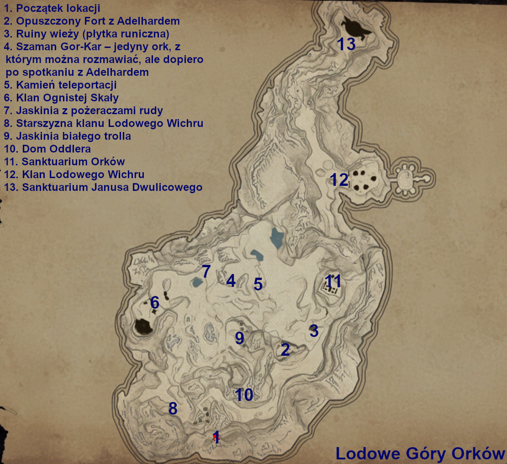

:::info Informacja

Wejście znajduje się w Wolnej Kopalni, nad miejscem gdzie w G1 był ork Tarrok. Będziemy potrzebować wyuczonej odporności na zimno by móc swobodnie przemieszczać się po lokacji (uczy Lee lub mikstura od Neorasa). By rozpocząć zadania z tutejszymi orkami musimy posiadać orkowy pancerz, który otrzymamy od Ur-Tralla za pokonanie demona w orkowej kopalni.

:::

## Mapa śnieżnych gór: {#mapa-snieznych-gor}

:::info Informacja

Warto na początku udać się do punktu 2 i pogadać z najemnikiem Adelhardem (tam też znajdziemy mapę), a następnie do punktu 5 i aktywować jedyny kamień teleportacyjny oraz pogadać z szamanem na wzniesieniu niedaleko. Polecam unikać orków dopóki nie dogadamy się z szamanem, jako że nie respektują oni symboli przyjaźni od orków z Górniczej Doliny.

:::

## Chata Oddlera {#chata-oddlera}

Na szczycie jednej z gór **(punkt 10 na mapie)** znajdziemy Oddlera niewidomego maga woda. Buduje on chatę ale brakuje mu narzędzi kilofów, młotków i pił. Narzędzia pewnie już mamy oddajemy, koniec zadania.
> Nagrodą jest zwój zmniejszenia potwora, dzięki któremu możemy spokojnie pokonać białego trolla już w 2 rozdziale i korzystać z jego [trofeum](https://docs.google.com/spreadsheets/d/16CPrngIhKSiwGtmHGXCJE5o_w-4k_s_nNq7H7wzVwos/edit?gid=205411919#gid=205411919&range=A12:B12) oraz [kaptura berserkera](https://docs.google.com/spreadsheets/d/16CPrngIhKSiwGtmHGXCJE5o_w-4k_s_nNq7H7wzVwos/edit?gid=104620460#gid=104620460&range=A57).

## Trofeum dla Groom Locka {#trofeum-dla-groom-locka}

Mamy przynieść głowę członka starszyzny wrogiego klanu. Znajduje się on niedaleko jaskini, którą dostaliście się do śnieżnej lokacji **(punkt 8 na mapie)**. Zabijamy orków i zanosimy głowę jednego z nich do Groom-Loka.

## Cena wolności {#cena-wolnosci}

Zadanie powiązane jest z [Stary przyjaciel Lee](/solucja/rozdzial-ii/#stary-przyjaciel-lee). Groom-Lock zleca nam zabicie białego górskiego trolla i przyniesienie jego skóry. Troll znajduje się w lodowej jaskini **(punkt 9 na mapie)**. Zabijamy i oddajemy skórę wodzowi, który zgadza się wypuścić Dariusa. Rozmawiamy z najemnikiem, później spotykamy go na farmie Onara.

## Wojna klanów {#wojna-klanow}

Mamy rozprawić się z wrogim klanem orków **(punkt 12 na mapie)**. Przy okazji robienia zadania [Ekspedycja Magów Ognia](/solucja/poboczne/#ekspedycja-magow-ognia) będziemy mogli zabrać im moc rudy co pozwoli Groom-Lockowi zaatakować wrogi klan. Możemy również samodzielnie pozabijać nieprzyjaznych orków bez zabierania mocy rudy, co pozwala wykonać cały wątek orków nawet w 2 rozdziale.

## Dodatkowe informacje {#dodatkowe-informacje}

- Dwulicowy Janus jest nieśmiertelny i warto iść do niego dopiero w ramach zadania [Bezgraniczna Potęga](/solucja/poboczne/#bezgraniczna-potega)
- W sanktuarium orków **(punkt 11 na mapie)** znajdziemy [Lodowy Młot](https://docs.google.com/spreadsheets/d/16CPrngIhKSiwGtmHGXCJE5o_w-4k_s_nNq7H7wzVwos/edit?gid=1118678332#gid=1118678332&range=A186:B186), najlepszy dwuręczny obuch w grze.
